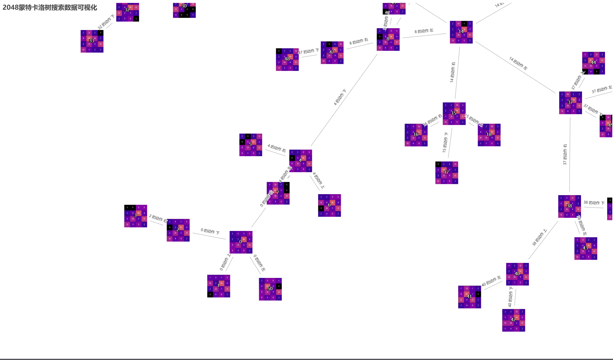

# Monte-Carlo-tree-visualization-game2048-
This project utilizes Pyecharts to visualize the tree nodes in the Monte Carlo Tree Search algorithm applied to the game ‘2048’. The interactive game states are displayed on a web page, allowing users to explore the decision-making process of the algorithm.
# HOW
run game2048.py, use"key_UP","key_LEFT","key_RIGHT","key_DOWN" to move, press space to show the process of Monte-Carlo-tree-Search of current game state.
# TO-DO
combine the game with graphics into one page
# SCREEN-SHOTS

